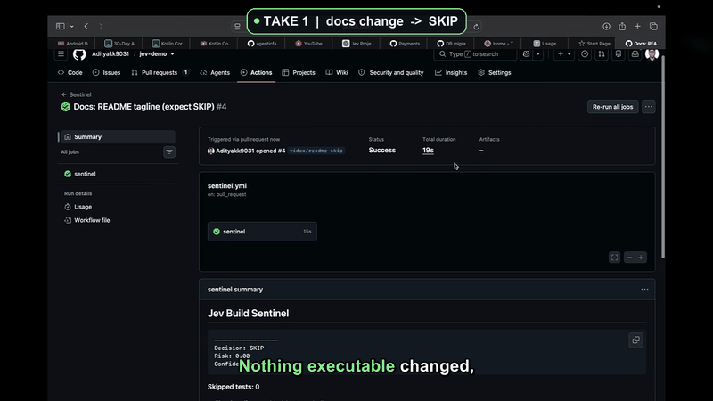

# Jev Build Sentinel

[](https://github.com/Adityakk9031/jev-build-sentinel/actions/workflows/ci.yml)

A GitHub Action that determines the **minimum safe amount of CI verification** for a pull
request — and automatically escalates to full CI whenever it isn't confident.

> The story isn't "AI skips tests."
> It's: **Jev is a low-latency CI decision engine that determines the minimum safe amount
> of verification — and a deterministic safety policy always escalates to full CI when
> uncertain.**

Measured on a real repo ([Adityakk9031/jev-demo](https://github.com/Adityakk9031/jev-demo),
157 tests, full suite 2m37s):

| Change | Sentinel decides | Runs | Wall time |
| ------ | ---------------- | ---- | --------- |
| One-line README edit | **SKIP** (risk 0, confidence 1) | 0 tests | **15s** |
| 3 files in `src/payments/` | **TARGETED** (risk 0.78, confidence 0.95) | 15 tests | **0.9s** |
| Database schema migration | **FULL** — forced by safety policy | 157 tests | **2m37s** |

## Demo & Architecture Walkthrough

https://github.com/user-attachments/assets/8868f1de-2e94-4fa8-ad9a-0928fab9e1e5

<p align="center">
  <a href="https://github.com/Adityakk9031/jev-build-sentinel/releases/download/v1.0.0/jev-build-sentinel-demo.mp4">
    
  </a>
  <a href="https://github.com/Adityakk9031/jev-build-sentinel/releases/tag/v1.0.0">
    
  </a>
  <a href="./docs/demo-video-script.md">
    
  </a>
</p>

### Live Execution Highlights

<p align="center">
  
</p>

> [!TIP]
> **What the 2.5-minute video shows ([`jev-build-sentinel-demo.mp4`](./jev-build-sentinel-demo.mp4) / [Release v1.0.0](https://github.com/Adityakk9031/jev-build-sentinel/releases/tag/v1.0.0))**:
> - **End-to-End Pipeline**: PR diff &rarr; Test mapper (reverse import graph) &rarr; TypeSafe Jev API &rarr; Deterministic safety policy &rarr; Selective execution & receipts.
> - **Live Proof on Real Pull Requests**:
>   - **Take 1 (SKIP)**: Docs-only change &rarr; 0 tests run, CI passes in **15s** (was 2m37s).
>   - **Take 2 (TARGETED)**: 3 payment files &rarr; only 15 relevant tests executed in **1.2s**.
>   - **Take 3 (FULL)**: Database schema migration &rarr; Safety policy halts optimization and runs all 157 tests safely.
> - **Full Sync**: Word-level neural subtitles + dynamic top pipeline stage badges over the native uncropped recording.


## Why

Most CI runs everything for every PR. That means a typo fix pays the same tax as a schema
migration — 2m37s of waiting before a human even looks at the code. The cost isn't the
runtime, it's the latency between every push and every review.

Sentinel asks one question per push: **how much verification does this change actually
need?** Then it runs exactly that — nothing more, nothing less — and refuses to optimize
when the change is genuinely risky.

## How it works

```text
PR opened
 ↓
Git diff (src/diff.ts)              changed files, added/deleted/modified lines, renames
 ↓
Test mapper (src/test-mapper.ts)    Jest/Vitest naming conventions + import graph + proximity
 ↓                                   + co-change history from past runs
Candidate tests
 ↓
Feature extractor (src/analyzer.ts) deterministic risk features
 ↓
Jev API (src/jev-client.ts)         one call, four atomic questions:
                                      verification → SKIP | TARGETED | FULL + confidence
                                      risk         → 0..1 score
                                      regression_risk → guardrail (≥ 0.8 forces FULL)
                                      test_0..N    → per-test keep scores (≥ 0.5 kept, cap 12)
 ↓
Safety policy (src/risk-engine.ts)  "when uncertain, run more tests, never fewer"
 ↓
Outputs + job-summary receipt + optional execution (src/executor.ts)
```

Jev never invents test paths — it only ranks candidates the local mapper produced. Answers
are typed and validated before the policy sees them. If the API fails, times out, or
returns low confidence, the deterministic rules take over and you get FULL.

### The safety policy (hard rules, not suggestions)

1. Jev confidence below threshold → **FULL**
2. Jev says FULL → **FULL**
3. Jev says TARGETED → run only the selected tests
4. Jev says SKIP → skip the expensive suite
5. High-risk changes always force **FULL** regardless of Jev: database migrations,
   dependency/lockfile changes, CI configuration, Docker infrastructure,
   authentication/security paths, core shared libraries
6. TARGETED is never empty — falls back to locally mapped candidates, else FULL
7. Jev API failure or timeout → **FULL**
8. Jev `regression_risk` ≥ 0.8 → **FULL**

The policy triggers are printed as a warning annotation and in the `reason` output, so
every decision is explainable after the fact.

### Execution, receipts, and learning

With `execute-tests: true`, Sentinel runs what it chose and shows its work:

- `▶ Executing TARGETED verification (3 test files): npx vitest run tests/payments/…`
- `▶ TARGETED verification finished: exit 0 in 1.2s` — with the runner's own test summary
- If a targeted batch fails, Sentinel re-runs the selected tests individually (bounded at
  12 probes) to attribute failures, then **falls back to the full suite automatically**

Every run also writes a job-summary receipt: decision, risk, confidence, policy triggers,
change analysis, and the exact executed command.

Frameworks are **detected, not assumed**: `vitest.config.*` or a `vitest` dependency →
`npx vitest run`; `jest.config.*` or jest → `npx jest`; otherwise the repo's own
`npm/yarn/pnpm/bun test` script. Package managers are detected from lockfiles.

## Quick start

```yaml
name: Sentinel
on: pull_request

jobs:
  sentinel:
    runs-on: ubuntu-latest
    outputs:
      decision: ${{ steps.sentinel.outputs.decision }}
      selected_tests: ${{ steps.sentinel.outputs.selected_tests }}
    steps:
      - uses: actions/checkout@v4
      - uses: actions/setup-node@v4
        with:
          node-version: 20
          cache: npm
      - run: npm ci
      - id: sentinel
        uses: Adityakk9031/jev-build-sentinel@v1
        with:
          jev-api-key: ${{ secrets.JEV_API_KEY }}
          execute-tests: 'true'
          confidence-threshold: '0.7'

  full-tests:
    needs: sentinel
    if: needs.sentinel.outputs.decision == 'FULL'
    runs-on: ubuntu-latest
    steps:
      - uses: actions/checkout@v4
      - run: npm ci && npm test
```

Add `JEV_API_KEY` as a repository secret (Settings → Secrets and variables → Actions).

### Conditional strategies

Because `decision` is an output, you can gate downstream jobs on it:

```yaml
  e2e:
    needs: sentinel
    if: needs.sentinel.outputs.decision != 'SKIP'
    # run expensive e2e only when something worth testing changed
```

### Inputs

| Input | Default | Description |
| ----- | ------- | ----------- |
| `github-token` | `${{ github.token }}` | Token used to read the PR diff. |
| `jev-endpoint` | `https://api.typesafe.ai/v1` | TypeSafe API base URL; POSTs to `{endpoint}/systemone`. |
| `jev-api-key` | — | TypeSafe API key (Bearer); never logged. Falls back to `JEV_API_KEY`. |
| `jev-model` | `jev-latest` | Jev model alias. Falls back to `JEV_MODEL`. |
| `mode` | `decide` | `decide` or `execute`; `execute` is equivalent to `execute-tests: true`. |
| `execute-tests` | `false` | Also run the selected tests (TARGETED) or the normal suite (FULL). |
| `confidence-threshold` | `0.7` | Below this Jev confidence, force FULL. |
| `timeout-ms` | `10000` | Jev request timeout. |
| `retries` | `2` | Retries on transient Jev failures (408/429/5xx). |
| `working-directory` | `.` | Repo root for mapping and execution. |

### Outputs

| Output | Description |
| ------ | ----------- |
| `decision` | `SKIP`, `TARGETED`, or `FULL`. |
| `risk_score` | Risk score returned by Jev (0..1). |
| `confidence` | Decision confidence returned by Jev (0..1). |
| `selected_tests` | Space-separated list of selected test files. |
| `tests_skipped` | Number of candidate tests skipped. |
| `reason` | Human-readable explanation of the decision. |
| `fallback_used` | `true` when the safety policy overrode Jev or a fallback was applied. |

## Jev integration

Sentinel speaks the TypeSafe evaluation API ([reference](https://docs.typesafe.ai/api)):

```text
POST https://api.typesafe.ai/v1/systemone
Authorization: Bearer <JEV_API_KEY>
{ "state": <structured request>, "model": "jev-latest", "questions": { ... } }
```

`state` is the structured request the pipeline already builds (diff, features, mapped
candidates, history). The questions are atomic and evaluated in parallel in one call —
no free text, no parsing. For local runs put your key in `.env` (copy `.env.example`;
`.env` is gitignored and real environment variables always win).

## Historical learning

When execution is enabled and `SENTINEL_HISTORY_FILE` points to a JSON file, Sentinel
records which tests were selected — and, when a targeted batch fails, which of them
actually failed — per changed source:

```json
{ "records": { "src/payments/stripe.ts": [{ "test": "tests/e2e/payment-refund.spec.ts", "failures": 2, "selections": 3, "lastSeen": "..." }] } }
```

The file is written back after every run, so learning survives across CI jobs. On later
runs a source's history becomes candidates again — ranked by failure weight — turning
static selection into a repository-specific test-risk model.

## Proof: the live demo

Everything above was validated end-to-end on
[Adityakk9031/jev-demo](https://github.com/Adityakk9031/jev-demo) — a generated app with
30 modules and 157 tests (150 unit + 7 slow e2e), wired to the real TypeSafe Jev API:

- **SKIP** — docs-only PR: `Decision: SKIP (risk 0, confidence 1)`, green in 15s
- **TARGETED** — 3 payment files: exactly 3 payment test files selected, `15 passed`,
  `exit 0 in 1.2s`, regression risk 0.78 (just under the 0.8 escalation bar)
- **FULL** — schema migration: annotation `Safety policy triggers: high-risk change:
  database migration`, all 157 tests green in 156.1s

The demo repo's workflow is 20 lines — the Quick Start above is almost exactly it. See the [Demo & Architecture Walkthrough](#demo--architecture-walkthrough) above for the complete visual walkthrough.

## Local development

```bash
npm install
npm run build:check   # strict TypeScript
npm test              # 115 unit tests (node:test)
npm run build         # tsc + ncc -> dist/index.js (the Action bundle)

npx tsx demo/offline-demo.ts readme        # SKIP
npx tsx demo/offline-demo.ts payment       # TARGETED + historical e2e test
npx tsx demo/offline-demo.ts auth          # FULL (safety policy override)
npx tsx demo/offline-demo.ts migration     # FULL (high-risk change)
npx tsx demo/jev-live-demo.ts              # one real call to TypeSafe (uses .env)
```

`dist/` is committed on purpose: it is the entrypoint `action.yml` runs. CI typechecks,
tests, rebuilds, and fails if the committed bundle is ever stale;
`.github/workflows/sentinel.yml` dogfoods this Action on every pull request.

Architecture is strictly layered: `types.ts` (contracts) → `diff.ts` / `test-mapper.ts` /
`analyzer.ts` (pure functions) → `jev-client.ts` / `risk-engine.ts` (decision) →
`pipeline.ts` (orchestration) → `report.ts` / `executor.ts` / `history.ts` (effects) →
`index.ts` (Action wiring).

## Roadmap

- [ ] Boxed PR comment with the decision, risk, and selected tests on every PR
- [ ] `fail-on-test-failure` input (turn the job red when executed tests fail)
- [ ] Suite-level skip accounting (`3 of 157 tests` in the receipt)
- [ ] Learning loop via `actions/cache` (no artifact wiring needed)
- [ ] More framework detectors (mocha, pytest, go test)

## License

MIT
