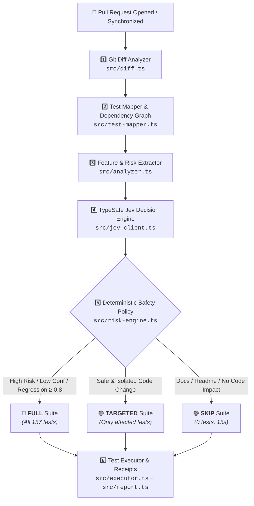

<div align="center">

# 🛡️ Jev Build Sentinel

### Low-Latency CI Decision Engine with a Deterministic Safety Spine

[](https://github.com/Adityakk9031/jev-build-sentinel/actions/workflows/ci.yml)
[](https://github.com/Adityakk9031/jev-build-sentinel/releases/latest)
[](https://github.com/Adityakk9031/jev-build-sentinel/tree/main/tests)
[](https://opensource.org/licenses/MIT)
[](https://nodejs.org)
[](https://www.typescriptlang.org)

<p align="center">
  <b>A GitHub Action that determines the <i>minimum safe amount of CI verification</i> for a pull request — and automatically escalates to full CI whenever it is uncertain.</b>
</p>

[**Watch Demo**](#-demo--architecture-walkthrough) •
[**Live Benchmark**](#-measured-impact) •
[**How It Works**](#-how-it-works) •
[**Safety Policy**](#-the-safety-policy-hard-rules-not-suggestions) •
[**Quick Start**](#-quick-start) •
[**Inputs & Outputs**](#-action-reference)

---

</div>

> **The story isn't "AI skips tests."**  
> It's: **Jev is a low-latency CI decision engine that determines the minimum safe amount of verification — and a deterministic safety policy always escalates to full CI when uncertain.**

---

## ⚡ Measured Impact

Measured on a real full-stack repository ([Adityakk9031/jev-demo](https://github.com/Adityakk9031/jev-demo), 30 modules, 157 tests, standard full suite **2m37s**):

| Pull Request Change | Sentinel Decision | Tests Executed | Wall Time | Speedup |
| :------------------ | :---------------- | :------------- | :-------- | :------ |
| 📝 **One-line README / docs edit** | `SKIP` (risk 0, confidence 1) | **0 tests** | **15s** | ⚡ **10.5x faster** |
| 💳 **3 files in `src/payments/`** | `TARGETED` (risk 0.78, confidence 0.95) | **15 tests** | **1.2s** (job 17s) | ⚡ **9.2x faster** |
| 🗄️ **Database schema migration** | `FULL` *(forced by safety policy)* | **157 tests** | **2m37s** | 🛡️ **100% safe** |

---

## 🎬 Demo & Architecture Walkthrough

https://github.com/user-attachments/assets/8868f1de-2e94-4fa8-ad9a-0928fab9e1e5

<p align="center">
  <a href="https://github.com/Adityakk9031/jev-build-sentinel/releases/download/v1.0.0/jev-build-sentinel-demo.mp4">
    
  </a>
  <a href="https://github.com/Adityakk9031/jev-build-sentinel/releases/tag/v1.0.0">
    
  </a>
  <a href="./docs/demo-video-script.md">
    
  </a>
</p>

### Live Execution Highlights

<p align="center">
  
</p>

> [!TIP]
> **What the 2.5-minute video shows ([`jev-build-sentinel-demo.mp4`](./jev-build-sentinel-demo.mp4) / [Release v1.0.0](https://github.com/Adityakk9031/jev-build-sentinel/releases/tag/v1.0.0))**:
> - **5-Stage Architecture**: Git diff &rarr; Reverse import test mapping &rarr; TypeSafe Jev API &rarr; Deterministic safety policy &rarr; Execution & receipts.
> - **Live Proof on Real Pull Requests**:
>   - **Take 1 (SKIP)**: Docs-only change &rarr; 0 tests run, CI passes in **15s** (was 2m37s).
>   - **Take 2 (TARGETED)**: 3 payment files &rarr; only 15 relevant tests executed in **1.2s**.
>   - **Take 3 (FULL)**: Database schema migration &rarr; Safety policy halts optimization and runs all 157 tests safely.
> - **Complete Synchronization**: Word-level neural subtitles + dynamic top pipeline stage badges over the native uncropped recording.

---

## 🎯 Why Jev Build Sentinel?

Most CI pipelines run everything for every pull request. That means a typo fix pays the same latency tax as a major schema migration — **2m37s of waiting before a human even looks at the code**. The bottleneck isn't raw machine cost; it's developer feedback latency on every single push.

Sentinel asks one question per push: **How much verification does this change actually need?**  
Then it runs exactly that — nothing more, nothing less — and refuses to optimize when the change is genuinely risky.

---

## 🏗️ How It Works



```text
PR opened
 ↓
Git diff (src/diff.ts)              changed files, added/deleted/modified lines, renames
 ↓
Test mapper (src/test-mapper.ts)    Jest/Vitest naming conventions + import graph + proximity
 ↓                                   + co-change history from past runs
Candidate tests
 ↓
Feature extractor (src/analyzer.ts) deterministic risk features
 ↓
Jev API (src/jev-client.ts)         one call, four atomic questions:
                                      verification → SKIP | TARGETED | FULL + confidence
                                      risk         → 0..1 score
                                      regression_risk → guardrail (≥ 0.8 forces FULL)
                                      test_0..N    → per-test keep scores (≥ 0.5 kept, cap 12)
 ↓
Safety policy (src/risk-engine.ts)  "when uncertain, run more tests, never fewer"
 ↓
Outputs + job-summary receipt + optional execution (src/executor.ts)
```

Jev never invents test paths — it only ranks candidates that the local mapper produced. Answers are strictly typed and validated before the safety policy evaluates them. If the API fails, times out, or returns low confidence, deterministic rules take over and trigger a **FULL** suite run.

---

## 🛡️ The Safety Policy (Hard Rules, Not Suggestions)

Sentinel is guarded by a non-negotiable deterministic spine:

1. **Low Confidence Escalation**: If Jev confidence is below threshold (default `< 0.7`) &rarr; **FULL**
2. **Jev FULL Verdict**: Jev explicitly requests full suite &rarr; **FULL**
3. **Jev TARGETED Verdict**: Jev identifies isolated test batch &rarr; runs only selected tests
4. **Jev SKIP Verdict**: Docs-only or zero-risk change with 0 candidates &rarr; **SKIP**
5. **High-Risk Overrides**: High-risk changes **ALWAYS force FULL** regardless of Jev:
   - 🗄️ Database migrations (`migrations/`, `schema.sql`, `prisma/`, etc.)
   - 📦 Dependency / lockfile modifications (`package.json`, `package-lock.json`, `pnpm-lock.yaml`, `yarn.lock`, `bun.lockb`)
   - ⚙️ CI / workflow definitions (`.github/workflows/`, `.circleci/`, etc.)
   - 🐳 Docker / infrastructure configs (`Dockerfile`, `docker-compose.yml`, `k8s/`, `terraform/`)
   - 🔐 Authentication & security files (`src/auth/`, `crypto.ts`, `jwt.ts`, `security/`)
   - 🧱 Core shared libraries (`src/core/`, `src/lib/`, `src/common/`)
6. **No-Empty TARGETED Guard**: If TARGETED has no selected tests, Sentinel falls back to local candidates; if none exist, it escalates to **FULL**
7. **Resilience & Fallback**: Jev API failure, network error, or timeout &rarr; **FULL**
8. **Regression Guard**: Jev `regression_risk ≥ 0.8` &rarr; **FULL**

Every policy trigger is printed as an active GitHub warning annotation and written to the step summary receipt.

---

## 🧪 Execution, Receipts, and Learning

With `execute-tests: true`, Sentinel executes the selected tests directly and streams structured telemetry:

- `▶ Executing TARGETED verification (3 test files): npx vitest run tests/payments/…`
- `▶ TARGETED verification finished: exit 0 in 1.2s` — with the runner's native test summary
- **Automatic Failure Attribution & Fallback**: If a targeted batch fails, Sentinel re-runs selected tests individually (bounded at 12 probes) to attribute failures, and **automatically falls back to the full suite**.

### Framework & Package Manager Detection

Frameworks and package managers are **auto-detected, not assumed**:
- `vitest.config.*` or a `vitest` dependency &rarr; `npx vitest run`
- `jest.config.*` or a `jest` dependency &rarr; `npx jest`
- Otherwise &rarr; the repo's native `npm / pnpm / yarn / bun test` script

---

## 🚀 Quick Start

Add `.github/workflows/sentinel.yml` to your repository:

```yaml
name: Sentinel CI
on:
  pull_request:
    types: [opened, synchronize, reopened]

jobs:
  sentinel:
    runs-on: ubuntu-latest
    outputs:
      decision: ${{ steps.sentinel.outputs.decision }}
      selected_tests: ${{ steps.sentinel.outputs.selected_tests }}
    steps:
      - uses: actions/checkout@v4
        with:
          fetch-depth: 0 # Full history for accurate diff analysis

      - uses: actions/setup-node@v4
        with:
          node-version: 20
          cache: npm

      - run: npm ci

      - id: sentinel
        uses: Adityakk9031/jev-build-sentinel@v1
        with:
          jev-api-key: ${{ secrets.JEV_API_KEY }}
          execute-tests: 'true'
          confidence-threshold: '0.7'

  full-tests:
    name: Full Test Suite
    needs: sentinel
    if: needs.sentinel.outputs.decision == 'FULL'
    runs-on: ubuntu-latest
    steps:
      - uses: actions/checkout@v4
      - uses: actions/setup-node@v4
        with:
          node-version: 20
          cache: npm
      - run: npm ci && npm test
```

> [!NOTE]
> Add `JEV_API_KEY` as a repository secret under **Settings &rarr; Secrets and variables &rarr; Actions**.

### Conditional Downstream Workflows

Because `decision` is an Action output, you can gate expensive end-to-end tests or deployments on it:

```yaml
  expensive-e2e:
    needs: sentinel
    if: needs.sentinel.outputs.decision != 'SKIP'
    runs-on: ubuntu-latest
    steps:
      - uses: actions/checkout@v4
      - run: npm run test:e2e
```

---

## ⚙️ Action Reference

### Inputs

| Input | Default | Description |
| :---- | :------ | :---------- |
| `github-token` | `${{ github.token }}` | GitHub token used to fetch the PR diff. |
| `jev-endpoint` | `https://api.typesafe.ai/v1` | TypeSafe API base URL (POSTs to `{endpoint}/systemone`). |
| `jev-api-key` | — | TypeSafe API Bearer key (never logged; falls back to `JEV_API_KEY` env). |
| `jev-model` | `jev-latest` | Jev model alias (falls back to `JEV_MODEL` env). |
| `mode` | `decide` | Operation mode: `decide` or `execute` (`execute` sets `execute-tests: true`). |
| `execute-tests` | `false` | When `true`, executes selected tests (`TARGETED`) or full suite (`FULL`). |
| `confidence-threshold` | `0.7` | Minimum Jev confidence score before forcing `FULL` suite. |
| `timeout-ms` | `10000` | Request timeout for the Jev API in milliseconds. |
| `retries` | `2` | Number of automatic retries on transient API errors (408/429/5xx). |
| `working-directory` | `.` | Target repository root for mapping and test execution. |

### Outputs

| Output | Type | Description |
| :----- | :--- | :---------- |
| `decision` | string | Final verdict: `SKIP`, `TARGETED`, or `FULL`. |
| `risk_score` | number | Risk score computed by Jev (`0.0` to `1.0`). |
| `confidence` | number | Decision confidence score (`0.0` to `1.0`). |
| `selected_tests` | string | Space-separated list of selected test files. |
| `tests_skipped` | number | Number of candidate test files skipped. |
| `reason` | string | Human-readable explanation of the decision and triggers. |
| `fallback_used` | boolean | `true` if deterministic safety rules overrode Jev. |

---

## 🧠 Historical Learning Loop

When test execution is enabled and `SENTINEL_HISTORY_FILE` points to a persistent JSON file, Sentinel records test selections and failures per changed source file:

```json
{
  "records": {
    "src/payments/stripe.ts": [
      {
        "test": "tests/e2e/payment-refund.spec.ts",
        "failures": 2,
        "selections": 3,
        "lastSeen": "2026-10-02T16:45:00.000Z"
      }
    ]
  }
}
```

On subsequent runs, historical co-changes and previously failed tests are automatically injected as high-priority candidates — turning static test selection into a repository-specific test-risk model.

---

## 🔬 Proof: The Live Demo

Everything above was validated end-to-end on [Adityakk9031/jev-demo](https://github.com/Adityakk9031/jev-demo) (a full-stack application with 30 modules and 157 Vitest tests), wired to the real TypeSafe Jev API:

- 🟢 **PR 1: SKIP** — Docs-only PR: `Decision: SKIP (risk 0, confidence 1)`, completed in **15s**
- 🟡 **PR 2: TARGETED** — 3 payment files: exactly 3 payment test files selected, `15 passed`, `exit 0 in 1.2s`, regression risk 0.78 (below the 0.8 escalation threshold)
- 🔴 **PR 3: FULL** — Schema migration: annotation `Safety policy triggers: high-risk change: database migration`, all 157 tests green in **2m37s**

See the [Demo & Architecture Walkthrough](#-demo--architecture-walkthrough) above for the complete visual recording.

---

## 💻 Local Development & Testing

```bash
# 1. Install dependencies
npm install

# 2. Strict TypeScript typechecking
npm run build:check

# 3. Run all 115 unit tests
npm test

# 4. Compile action bundle (tsc + ncc -> dist/index.js)
npm run build

# 5. Run offline scenario simulations
npx tsx demo/offline-demo.ts readme        # Simulates SKIP
npx tsx demo/offline-demo.ts payment       # Simulates TARGETED + historical e2e test
npx tsx demo/offline-demo.ts auth          # Simulates FULL (safety policy override)
npx tsx demo/offline-demo.ts migration     # Simulates FULL (high-risk change)

# 6. Run live TypeSafe Jev evaluation (reads JEV_API_KEY from .env)
npx tsx demo/jev-live-demo.ts
```

### Architectural Layering

```text
src/types.ts           contracts, interfaces, and schemas
 ↓
src/diff.ts            git diff parser and line change analyzer
src/test-mapper.ts     import graph builder and naming convention resolver
src/analyzer.ts        risk feature extractor
 ↓
src/jev-client.ts      TypeSafe /systemone API client with retries and validation
src/risk-engine.ts     deterministic safety policy and rule evaluator
 ↓
src/pipeline.ts        end-to-end workflow orchestration
 ↓
src/report.ts          GitHub job summary and annotation receipt generator
src/executor.ts        framework detection and targeted test runner
src/history.ts         learning database and co-change history tracker
 ↓
src/index.ts           GitHub Action entrypoint wiring
```

---

## 🗺️ Roadmap

- [x] Auto-detection for Vitest, Jest, and native scripts
- [x] Fallback attribution with individual test probing
- [x] High-risk deterministic safety policy overrides
- [ ] PR comment reporting with formatted decision badges
- [ ] `fail-on-test-failure` input flag
- [ ] Automated learning loop persistence via `@actions/cache`
- [ ] Extended framework support (Pytest, Go test, Cargo test)

---

## 📄 License

[MIT](LICENSE) © Aditya Kumar Singh
